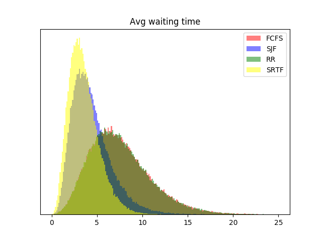
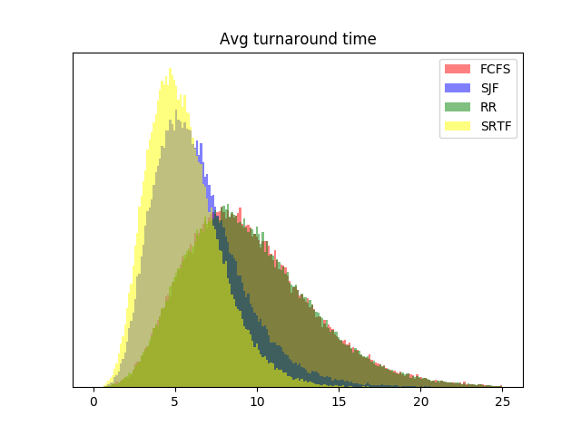

# NOSE-AE2
Implementation of schedulers and dispatchers for FCFS, SJF, SRTF, RR scheduling algorithms.

# Ben Johnston 2432411J Lab 01
# Franciszek Sowul 2482997S Lab 10

>>> Your report should include a heading stating your full names, matriculation
numbers and lab groups, and a discussion of your findings for the “interesting” seed
values outlined earlier (i.e., what was the relative performance of the four algorithms,
whether it deviated from your expectations, and what you believe is the cause of the
deviation based on the internal state of the simulator). Feel free to also include any
feedback you may have on the assessed exercise.

On average FCFS waiting time and RR waiting time are identical so it is weird when they differ alot.
We can also see that the waiting time for for SRTF is less than the SJF waiting time.
Another observation is that we can see that FCFS and RR wait times on average are very similar however we found if all processes are long RR performs worse than FCFS for the seed 4243287395.

We also know that turnaround time = waiting time + service time so the trends described above and the statements on the performance of algorithms compared to the others will stay the same.

For the two seeds given in the sample outputs in the specification we see that the seed 1523376833 has lower wait and turnaround times on average for all schedulers in comparison to the seed 3672961927.

When testing our schedulers with the test seeds we were pleased to see that the values we got for our average turnaround time and our average wait times were as expected.
Some brief feeeedback that I personally have is that this excercise actually helped me visualize the differences and also similarities between schedulers and also the differences between pre-emptive and non pre-emptive scheduling.
