# Ben Johnston 2432411J Lab 01
# Franciszek Sowul 2482997S Lab 10

In order to find some interesting seeds, instead of just trying random ones, we implemented a more systematic approach. We modified main.py so that it run 4 simulations (FCFS, SJF, RR and SRTF) repeatedly 10000 times with different seed values. For each such run its 'weirdness' was measured, based on some factors we came up with. Then, the runs and seeds corresponding to them were sorted by this 'weirdness' factor and the first one off this list was deemed interesting. However, to know what counted as 'weird' in the first place, we had to find out what was the norm. For that, we plotted histograms of average waiting and turnaround times: 

Below is a table with expected values and standard deviations of the distributions presented above:

|      | E(avg_waiting_time) | sigma(avg_waiting_time) | E(avg_turnaround_time) | sigma(avg_turnaround_time) |
|------|---------------------|-------------------------|------------------------|----------------------------|
| FCFS | 7.511s              | 3.388s                  | 9.562s                 | 3.943s                     |
| SJF  | 4.402s              | 2.199s                  | 6.413s                 | 2.721s                     |
| RR   | 7.555s              | 3.388s                  | 9.557s                 | 3.934s                     |
| SRTF | 3.549s              | 1.653s                  | 5.549s                 | 2.211s                     |

On average FCFS waiting time and RR waiting time are identical so it is weird when they differ alot. We can also see that the waiting time for for SRTF is less than the SJF waiting time. We also know that turnaround time = waiting time + service time so the trends described above and the statements on the performance of algorithms compared to the others will stay the same.

CASE STUDY 1: Seed 3162636434

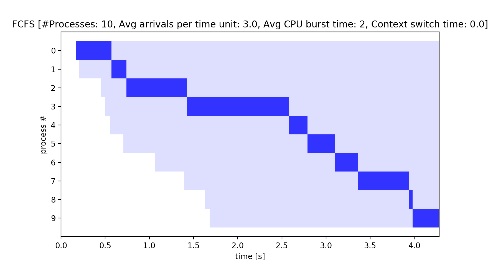
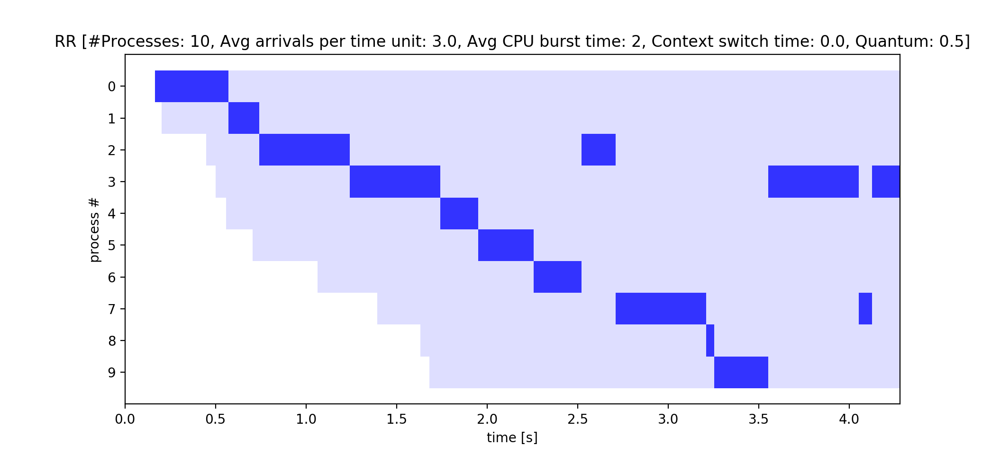
As we can see all processes have a a very short service time and when the service time is less than the RR quantum, FCFS and RR proceed identically.

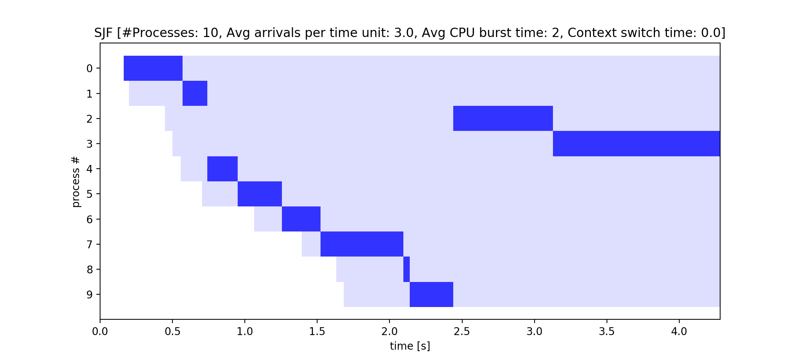
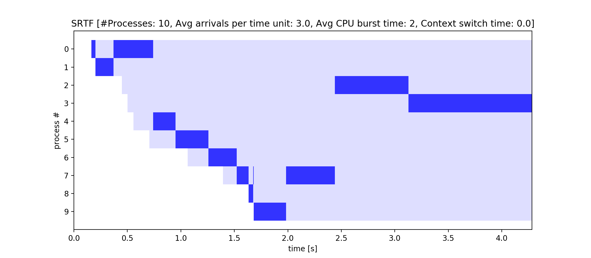
Finnaly, we see that the SRTF scheduler will keep processing the process identically to SJF unless the next process's burst time is less than the current process time remaining and both schedulers still follow the shortest time first as we can see the longer processes 2 and 3 are performed last in both schedulers.

CASE STUDY 2: Seed 317537355

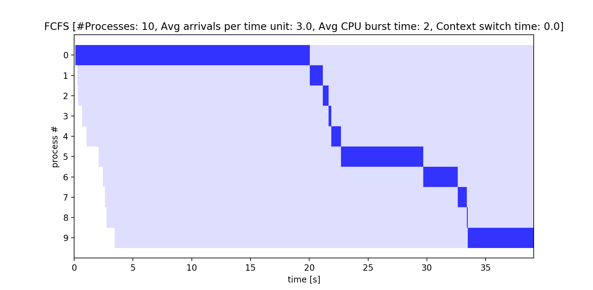
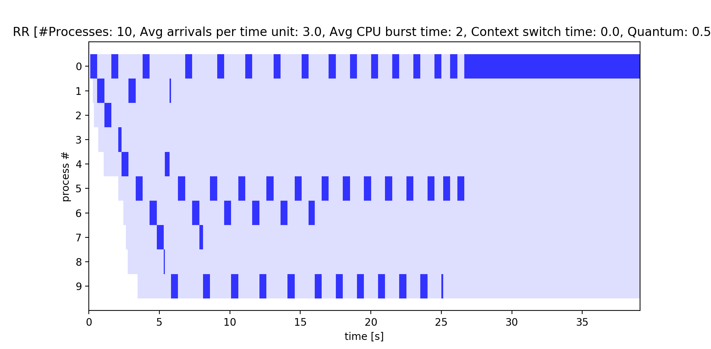
As we see for this seed most processes have a very long service time, and both schedulers act extremely different, the RR is choosing to take smaller chunks with less service time in comparison to the FCFS.

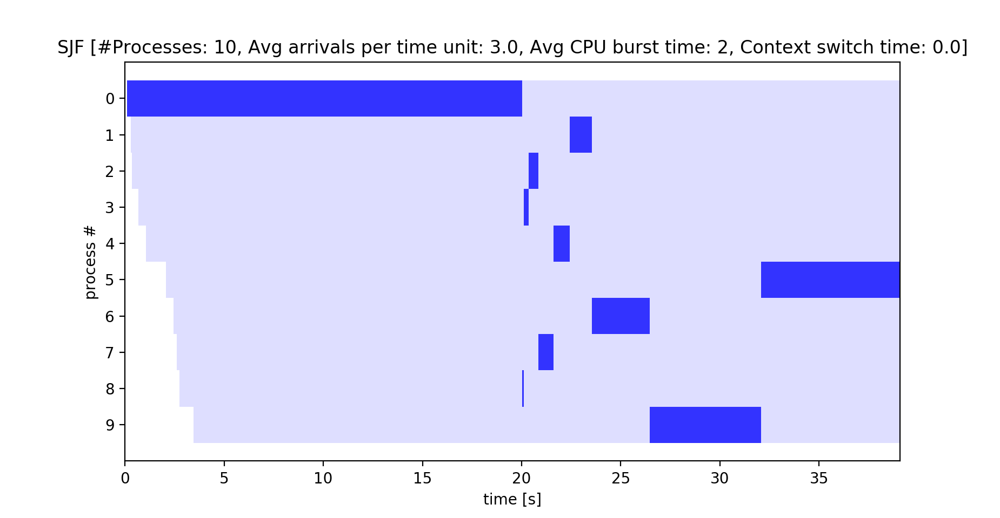
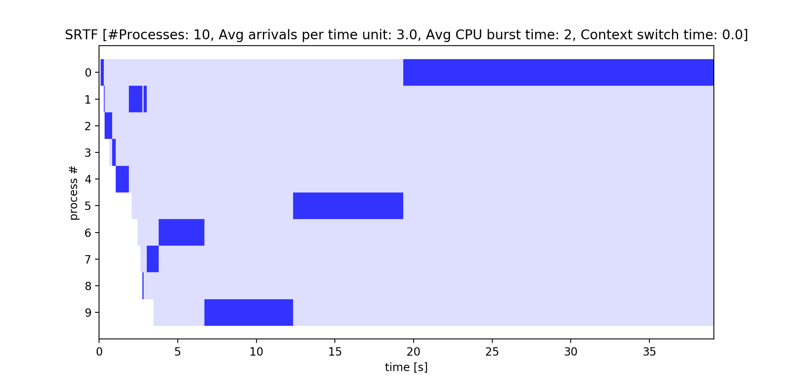

As we see SJF will execute process 8 right after it has finished executing process 0 as 8 has the next shortest job but where it varies from SRTF is when SRTF aknowledges another process with a shorter run time it will break up processes into chunks and will prioritise the shortest job. The superiority of pre-emptive over non-pre-emptive schedulers is shown here as both FCFS and SJF are stuck executing process 0 meanwhile, the pre-emptive schedulers can just switch processes which saves them waiting time.

We can see with both these seeds, one illustrating the effect of shorter service times and one of longer service times the difference of these schedulers with different processes.

CASE STUDY 3: Seed 968693226
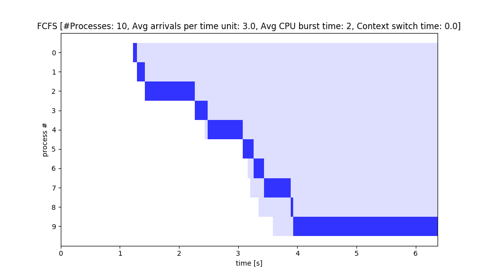

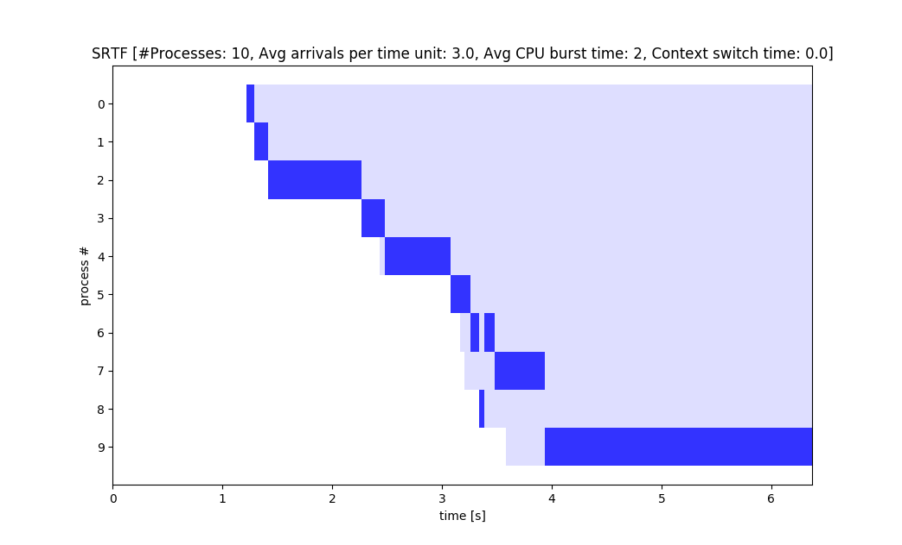
We think this seed is interesting because all schedulers made similar decisions. This is partly because the processes' service times are quite short, and also because the differences between consecutive arrivals are large. This means that most of the time, only one process is in a runnable state, so preemptive schedulers have only one choice and so they choose similarly to non-preemptive ones.

CASE STUDY 4: Seed 4243287395
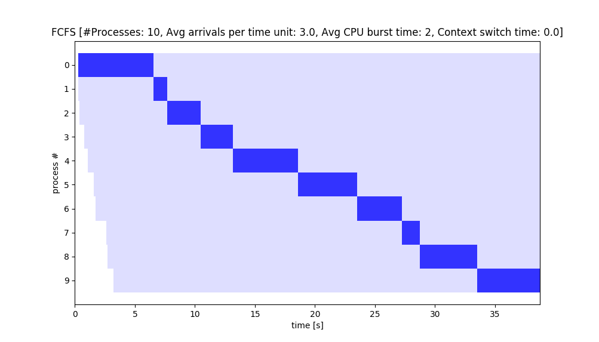
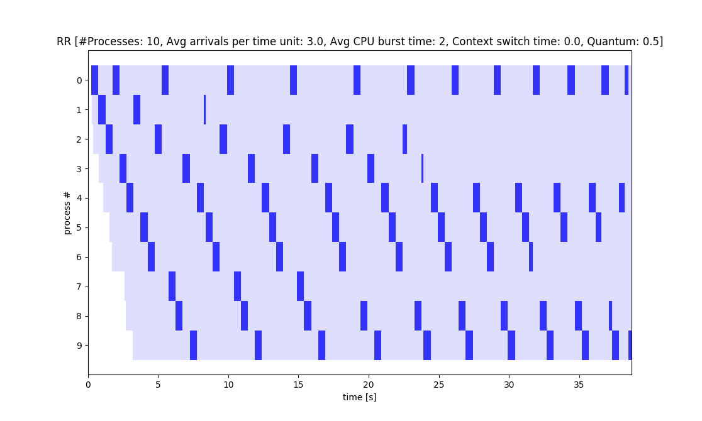
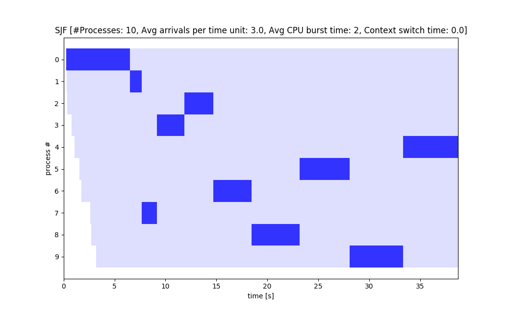
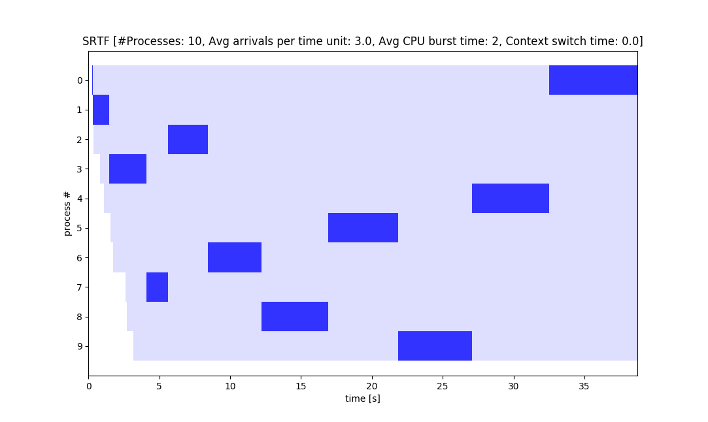
We think this seed is interesting because RR performed much worse than FCFS. This happened because all the processes have similar length and they're relatively long as well. At certain point RR had to 'loop' through all the existing processes, so each of them waited 9 quanta of time before they got more time on the CPU. Because of this, the average waiting time for RR was a lot greater than FCFS's.
